# CS683 Project Assignment - Habit Tracker
### By Divya Thomas

--
## 1. Overview
In this day and age, people are busy. It's hard to stick to a routine and develop good habits while surrounded by distractions and long to-do lists. Since good habits are so important and beneficial to your overall wellbeing and everyday life, Habit Tracker is an organized consistent tool that can be used to keep people on track, especially those like me who LOVE to stay organized, keep lists, and track their progress. 

This is an application that allows users to plan out and track completion of their daily habits, with the potential for reminders and the ability to check thier consistency over time.

## 2. Related Work

My main inspiration for this application is the "Routines" iOS application by Care/Of. I use this application daily to track my morning and night routines. 

As someone who gets easily distracted by my phone in the morning or other priorities, this application has helped me tremendously in developing good, consistent habits that set me up for success. I have never felt more organized and accomplished than after I started using this application.

While the "Routines" application is strictly for morning and evening routines, rather than general habits. It allows users to set up and list customized steps to thier routines, and check them off as they go about their days. The application also provides reflection questions in which the user can assess their mental health and periodically encourages them when they have completed a consistent streak of completing particular tasks over a course of time. At the end of the week, the user is able to find a detailed progress report connecting their reflections/moods with te consistency of thier completion of tasks in their routines.

I envision the Habit Tracker to be similar to this application in that it shows a list of customizable items for the user to be able to check off as their days progress. I want this to also track trends and provide some sort of report and analysis of the user's progress if time permits. 

## 3. Requirement Analysis and Testing

|   |   |
|---|---|
|Title| Create/View Habit List (Essential) *COMPLETED* |
|Description| As a user I want to be able to create a list of habits I would like to include in my life so that I am able to customize to my preference and be able to view my list of expectations. |
|Mockups| 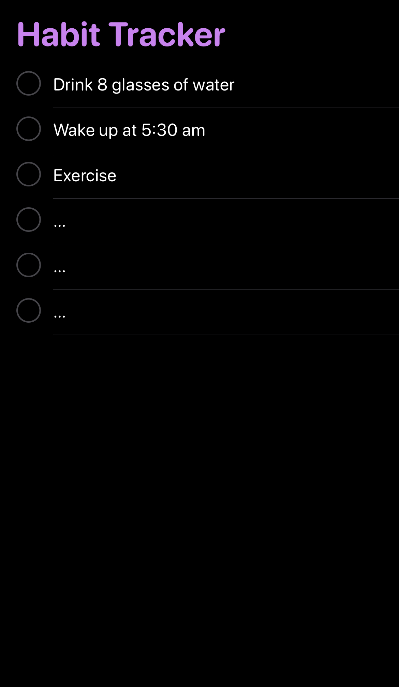 |
|Acceptance Tests| Given a prompt is shown on the screen, The user is able to type a habit and add it to the list of existing habits already on the screen. |
|Test Results - ITERATION 1| Main Habit List Page (unfinished): 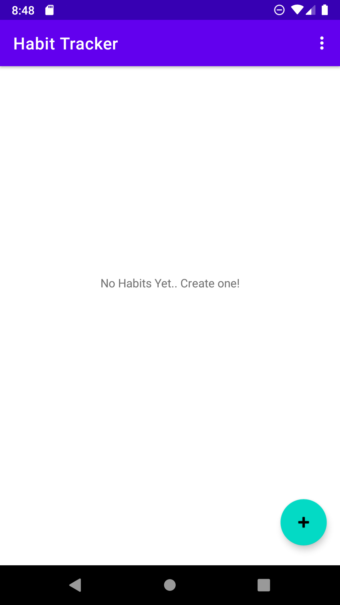 Create Habit Page:  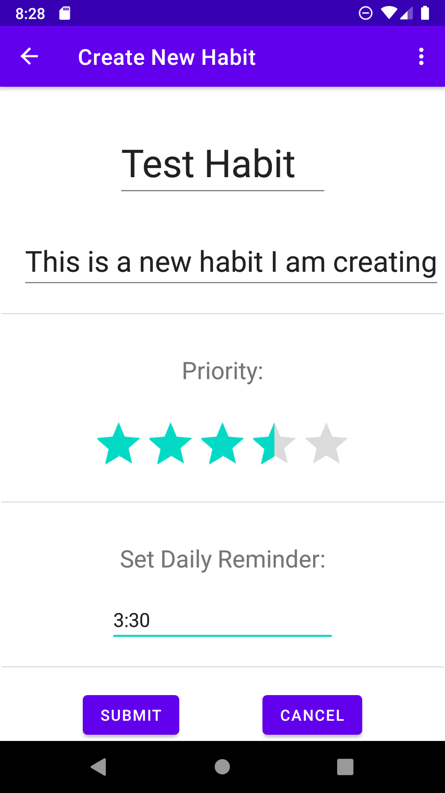 On submit: |
|Test Results - ITERATION 2| Main page showing habits created from the Create New Habit page and submitted: 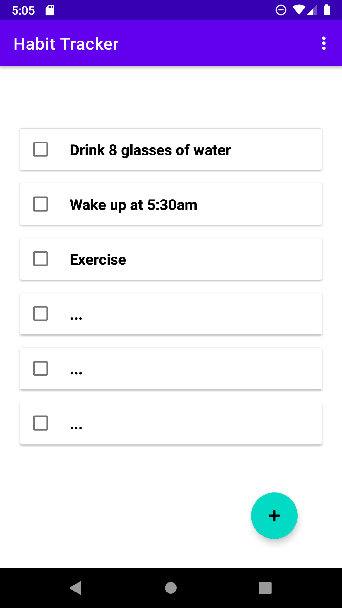 Log: 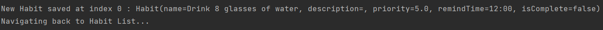 |
|Test Results - ITERATION 3|Test Habit created (before editing):  On Submiting: 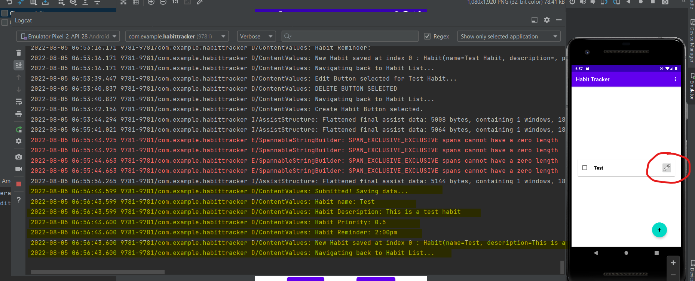 On Clicking the edit button and changing values: 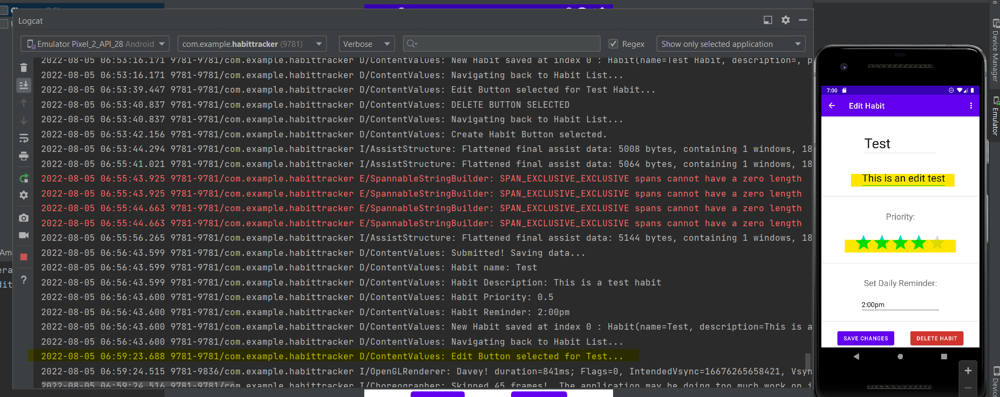 After "Save Changes" is pressed and edit button for same habit is pressed again - changes persisted: 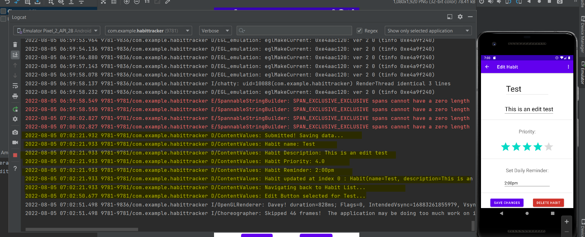 On delete button selected - Habit is removed : 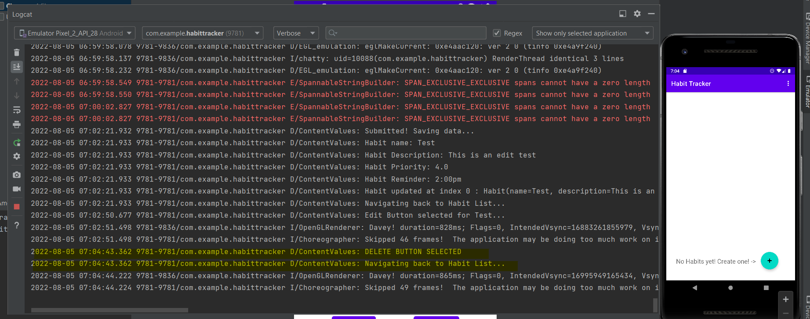|
|Status - Iteration 1| Implemented an outline of the main page and completed implementation of the "Create Habit" page and saves a new Habit object on submit 
|Status - Iteration 2| Implemented the Main Habit List page to display all saved habits. |
|Status - Iteration 3| Configured the Edit Habit button and page which allows the user to edit details of a particular habit and/or delete it if desired.|

|   |   |
|---|---|
|Title| Check off/Mark Habits Complete (Essential) *COMPLETED*|
|Description| As a user I want to be able to mark each habit complete as I go about my day so that I am able to visualize my progress. |
|Mockups| 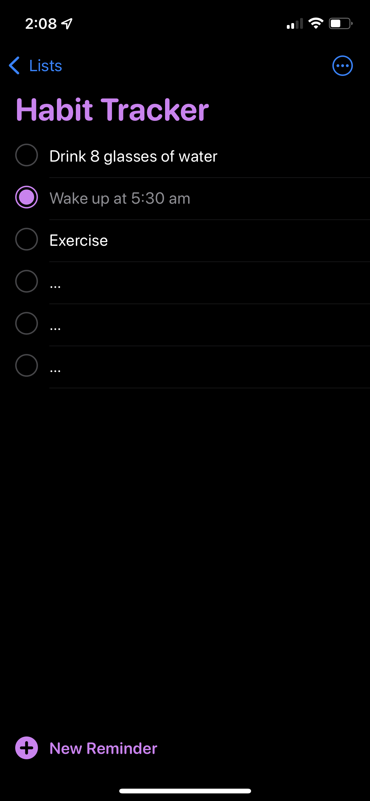 |
|Acceptance Tests| Given the list of habits on the screen, The user is able to mark each one complete either through a radio button or checkbox. |
|Test Results - Iteration 2|Habit marked complete: 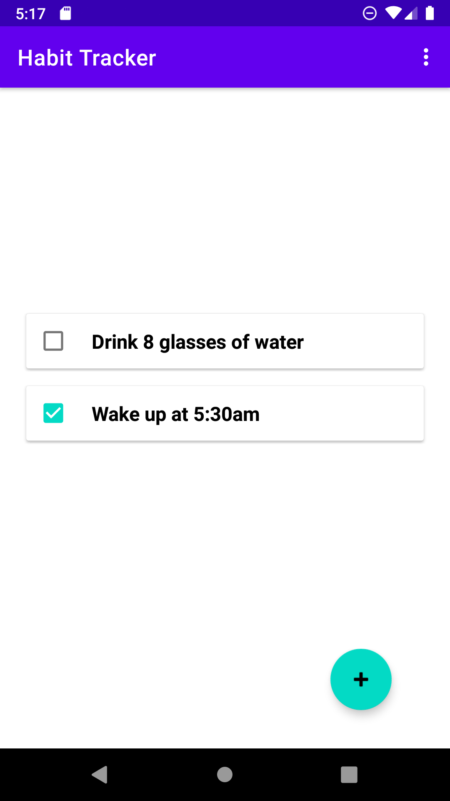 Habit completion parameter persists when leaving the main page and coming back. ORDER OF STEPS: Wake up marked complete -> create new habit button -> saved a new habit (exercise) -> returned to main page -- RESULT: Wake up habit is still marked complete 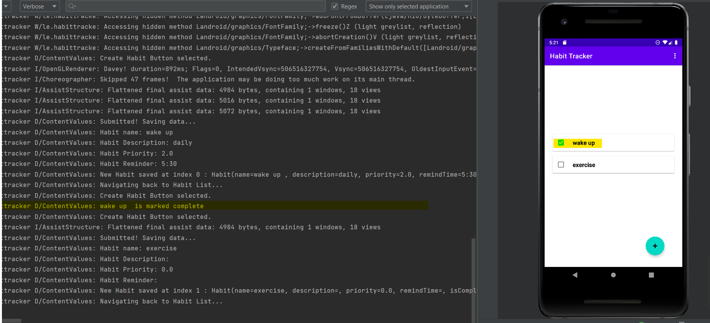 Habit marked incompletion parameter persists when leaving the main page and coming back. ORDER OF STEPS: Wake up marked incomplete -> create new habit button -> CANCEL button clicked -> returned to main page -- RESULT: Wake up habit is still marked incomplete 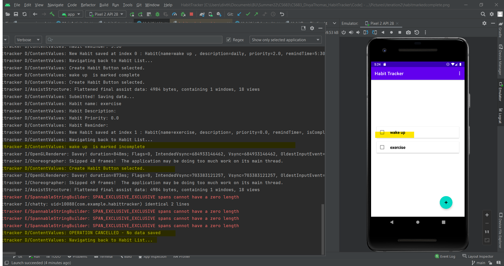|
|Status - Iteration 2|Habits are able to be marked complete and these values persist when going between fragments.|

|   |   |
|---|---|
|Title| Refresh List (Desirable) *COMPLETED*|
|Description| As a user I want to be able to refresh my habit list every day so that I am able to consistently go through this completion progress day by day and eventually develop a habit. |
|Mockups| 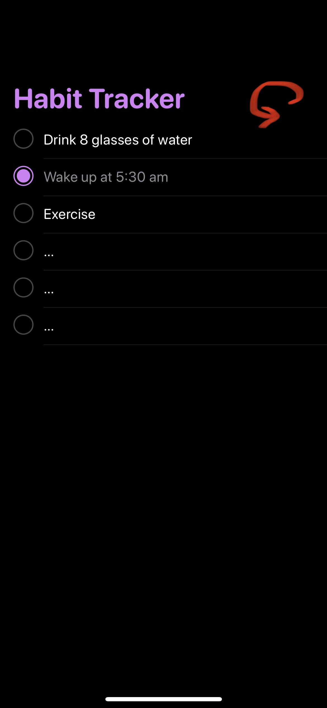 |
|Acceptance Tests| Given that the screen shows a list of completed and not completed habits, the user is able to refresh the list to clear all checkmarks and start new with a list of non-completed tasks. |
|Test Results|[TODO]|
|Status|[TODO]|

|   |   |
|---|---|
|Title| Save Progress and Report (Desirable) |
|Description| As a user I want to track my completion rate of each habit and have some sort of report or feedback for reaching certain checkpoints (3 days in a row, 1 week, etc.). |
|Mockups| 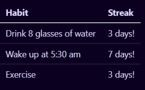 |
|Acceptance Tests| Given that a user selected to complete a habit, Data is then stored and the streak count for that habit is incremented. Vice versa when the user deselects the habit (different from refreshing) |
|Test Results - Iteration 4|Proof of Database setup from UI. Pulls the 2 previously added records from Database table. 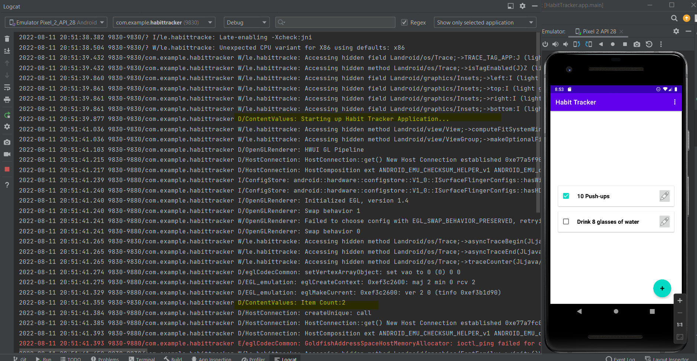|
|Test Results - Iteration 5|[TODO]|
|Status - Iteration 4| Room Database is configured and habits are being saved and updated accordingly. Completely removed dependence of the habitArray List that was being used before.|
|Status - Iteration 5|Added additional columns and configurations for tracking habit progress reports and streaks|
|TODO (If time permits) | Set up a "reports" page that displays streak data for the user to be able to check his/her progress |

|   |   |
|---|---|
|Title| Prioritize Habits (Optional) |
|Description| As a user I want to be able to choose habits of higher importance so that I can focus on specific ones at a time if need be. |
|Mockups|  |
|Acceptance Tests| Given that the list of habits have varying priorities, The user can indicate high priority habits |
|Test Results - Iteration 1|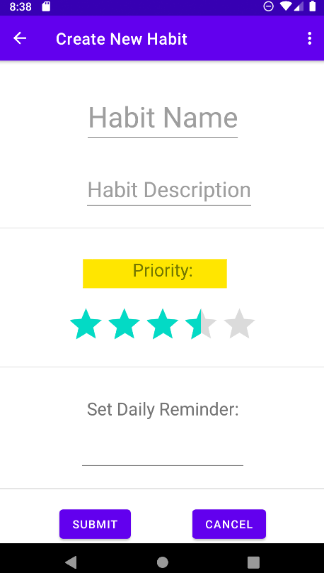 Output on submit: |
|Test Results - Iteration 2|Filter button display on UI (no functionality yet): 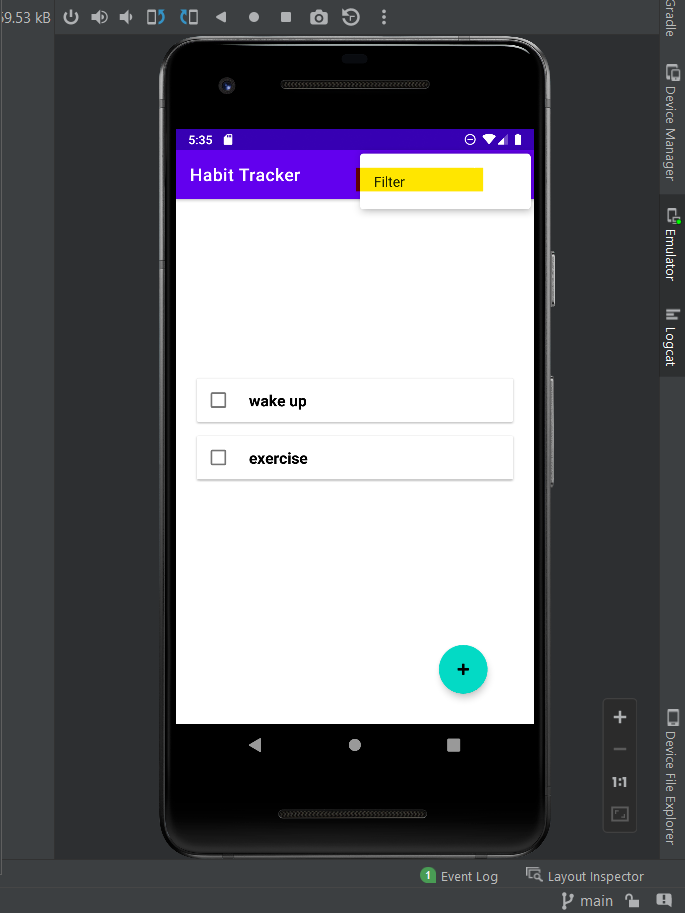|
|Status - Iteration 1| Set up a priority param upon creation of the habit|
|Status - Iteration 2| Set up a filter button on the main page to add sorting functionality based off of priority|
|TODO (If time permits) | Configure sorting functionality on the filter button |

|   |   |
|---|---|
|Title| Set Reminders (Optional) |
|Description| As a user I want to be able to set a reminder on my phone for specific habits so that I am kept on track even when I forget to check the application itself. |
|Mockups|  |
|Acceptance Tests| Given that the application can run in the background of others, The user sets a reminder on the application for a habit and the user is alerted at the specified time.|
|Test Results - Iteration 1|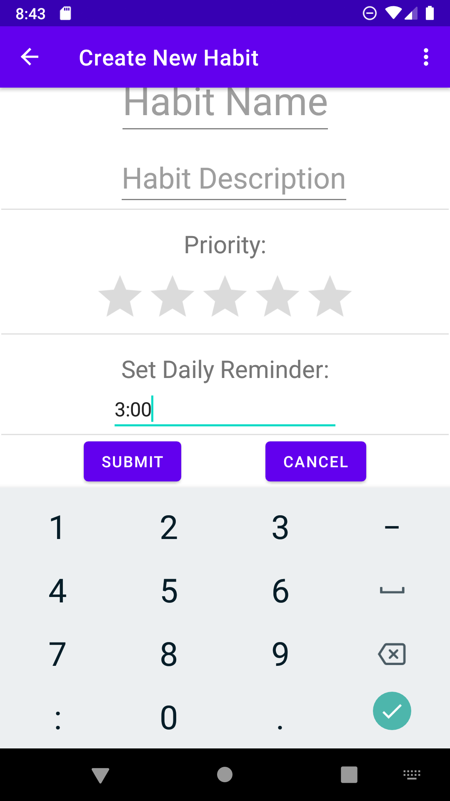 Output on submit: 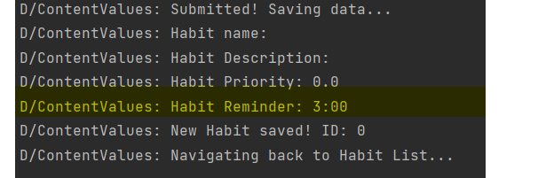 |
|Status - Iteration 1| Set up a reminder param upon creation of the habit|
|TODO (If time permits) | Set up a push notification for reminders, allow user the option to turn off reminder |

## 4. Design and Implementation
### ITERATION 1:

This iteration consisted of configuring the general organization and setup of the application. All main pages have been created and will be enhanced as time progresses. 

The main "Habit List" page will display all habits to be checked off and refreshed by the user from time to time. The bottom right corner features a button to direct the user to the "Create Habit" page. It is desirable to have a sorting functionality added to this page to sort on priority levels in the future. 

UI Display: 

Source Code: 

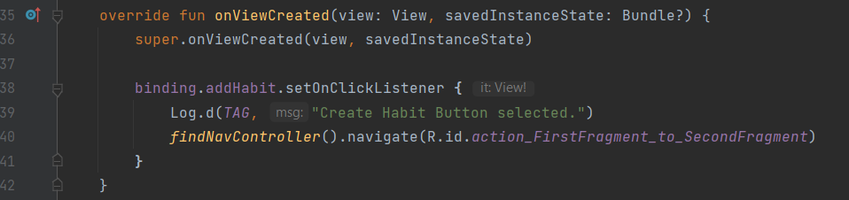 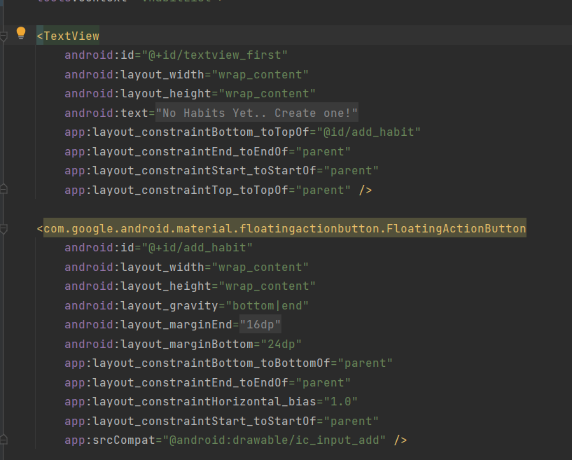Button functionality implemented in HabitList.kt and habit_list.xml

The secondary "Create Habit" page is vital to this application as it allows the user to create and customize thier own habits. It prompts the user to input a habit name, description, priority, and a daily reminder time for push notifications. The page features a cancel button to revert back to the main page without saving the new habit. It also has a submit button, which saves all inputted data into a new Habit object, defined by the Habit.kt data class. In the upcoming iterations, these objects will be stored in a database or JSON and pulled by the main Habit List page for display.

UI Display: 

Source Code: 

 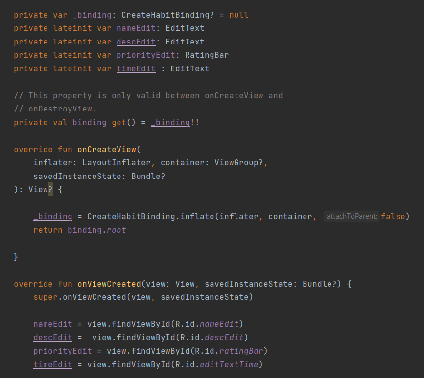 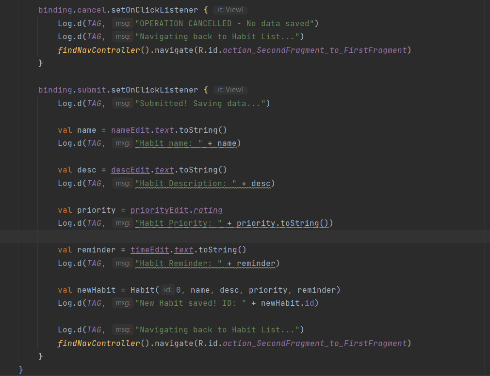 Create Habit page configuration (create_habit.xml and CreateHabit.kt)

Habit.kt data class structure: 

### ITERATION 2: 

This iteration primarily focused on the configuration of the Main Habit page and the ability for it to persist data as the user moves from page to page on the UI. 

The configuration of the Main Habit page required the setup of a RecyclerView, to allow for variablility in number of habits created and to allow the user to scroll through in them in the event that more habits are added that cannot all fit on the page.

The RecyclerView widget is configured within the habit_list.xml using a LinearLayoutManager. Code below:

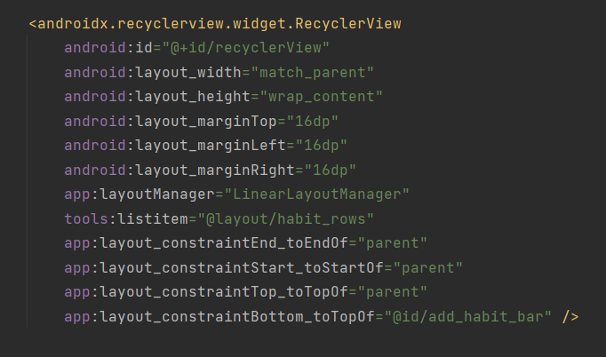

The list item used in this RecyclerView provides the template to which the habit items will be listed into the RecyclerView. This is set up in the habit_rows.xml file below. This xml setup consists of an overarching CardView to hold a TextView containing the habit name, and a CheckBox widget to indicate completion/incompletion of the habit.

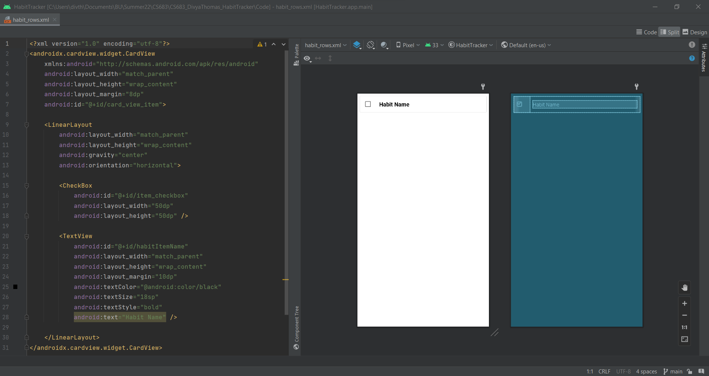

Along with the habit_rows.xml, the display needed to be infated using a binding class associated with the xml. Please see this HabitRowsBinding.kt class below. 

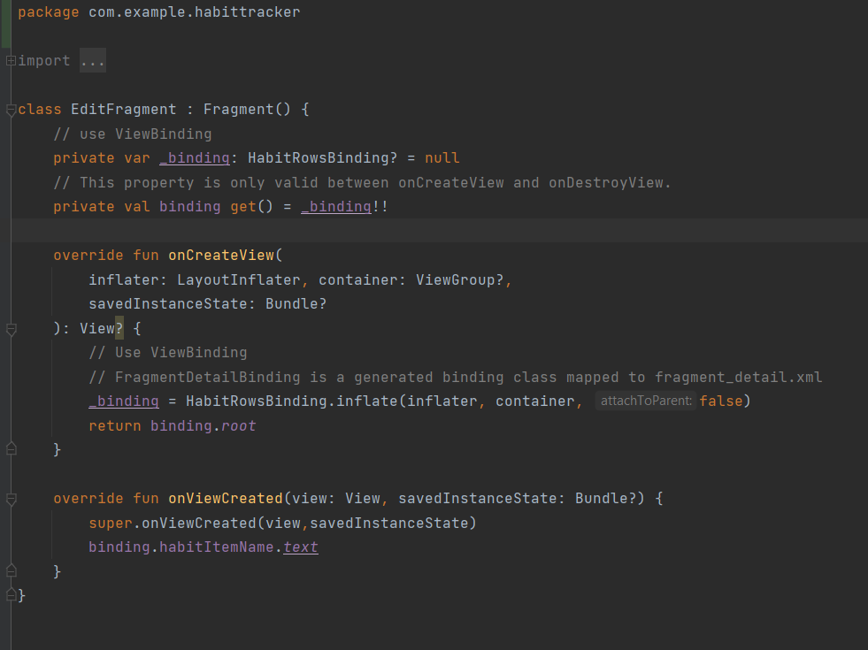

Eventually, I plan to set up a database to store and load habit data peristently. Meaning that even on application restart, the user will not have to recreate all data. Until I am able to configure this, I will use a companion object of HabitList.kt to store an ArrayList of Habits as a placeholder. As each new habit is created, it will be stored in this list, to be taken up and organized by the RecyclerView.

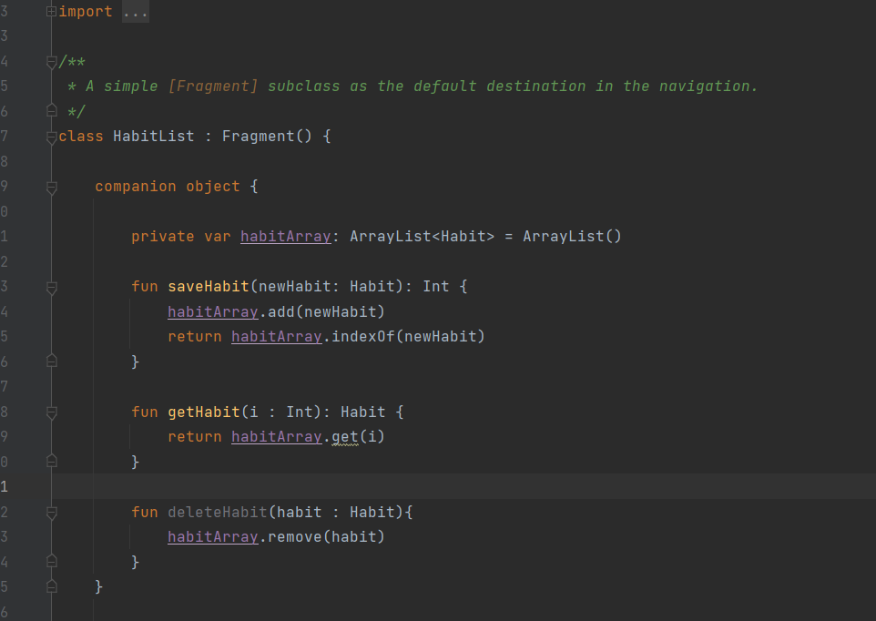

In order to translate the data set information into something readable for the xml, it is necessary to set a HabitListAdapter.kt. As of now, the only information necessary to translate by the main Habit List page, is the habit name and checkbox (isCompleted indicator). This is why these are the only two attributes of the Habit class that are being binded and set to UI widgets. More can be added on within this Adapter if needed in the future. 

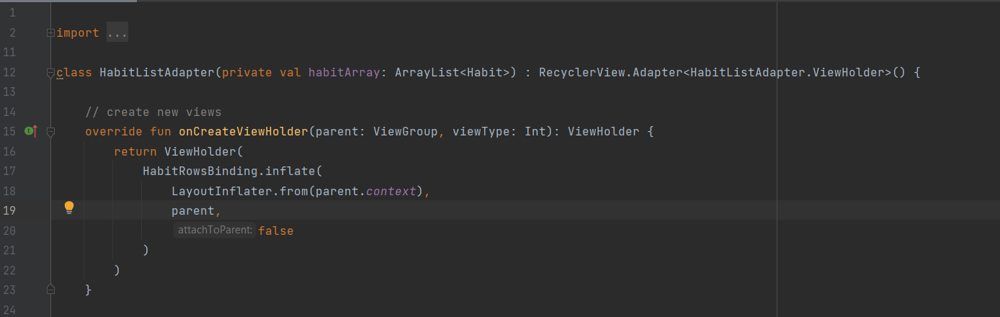
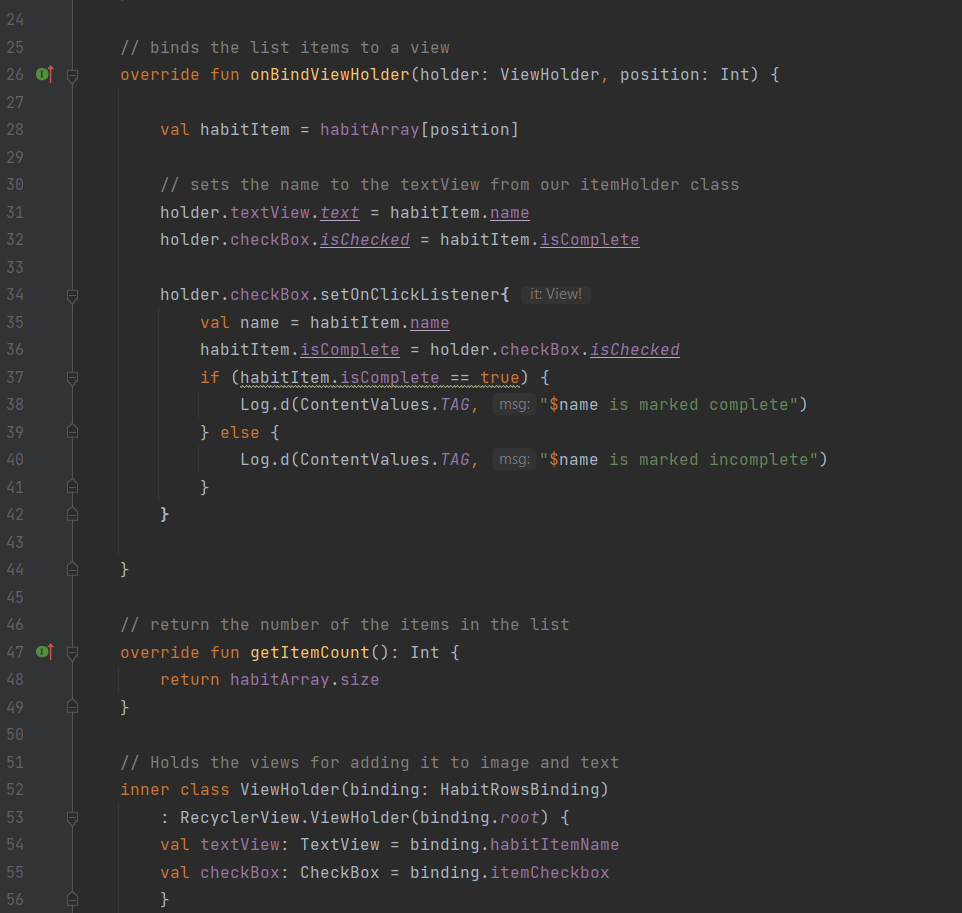

This setup is what allowed me to configure the Habit List page to display all created and saved habits while also allowing the user to mark each as complete or incomplete directly from the UI. This provides the user with a simple and clearly usable interface that they can interact with and update as they complete complete habits throughout the day. 

### ITERATION 3:

This third iteration focused on completing the last "Essential" requirement of the Habit Tracker application. This consisted of implementing a new Edit Habit fragment. I used the help of online research, the already configured Create Habit configuration, and similar work done on Lab2 to help me with this aspect of the project.

In order to navigate from page to page the nav_graph.xml file needed to be adjusted to add a third fragment (the Edit Habit fragment) and actions needed to be implemented to navigate between the first and third fragments, with the first being the main habit list with the edit icon that will be used to set the onClickListener to navigation. 

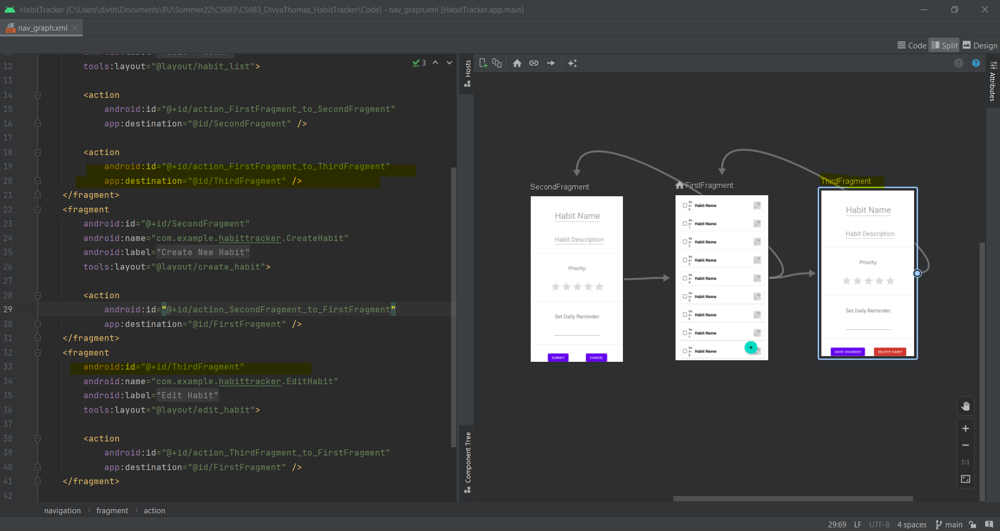

There needed to be additions to the HabitList.kt companion object to ensure the edit/delete configurations were working properly. One of which was an editPos attribute, which would be set when an item was selected for editing. This value holds the position of this habit in the habitArray to be mapped while editing or during deleting. It basically stores the position of the "active edit habit". The other addition was the function to delete a habit within the habitArray, and therefore the entire system, given a position. This method is to be called when the delete button is selected from the Edit Habit page.

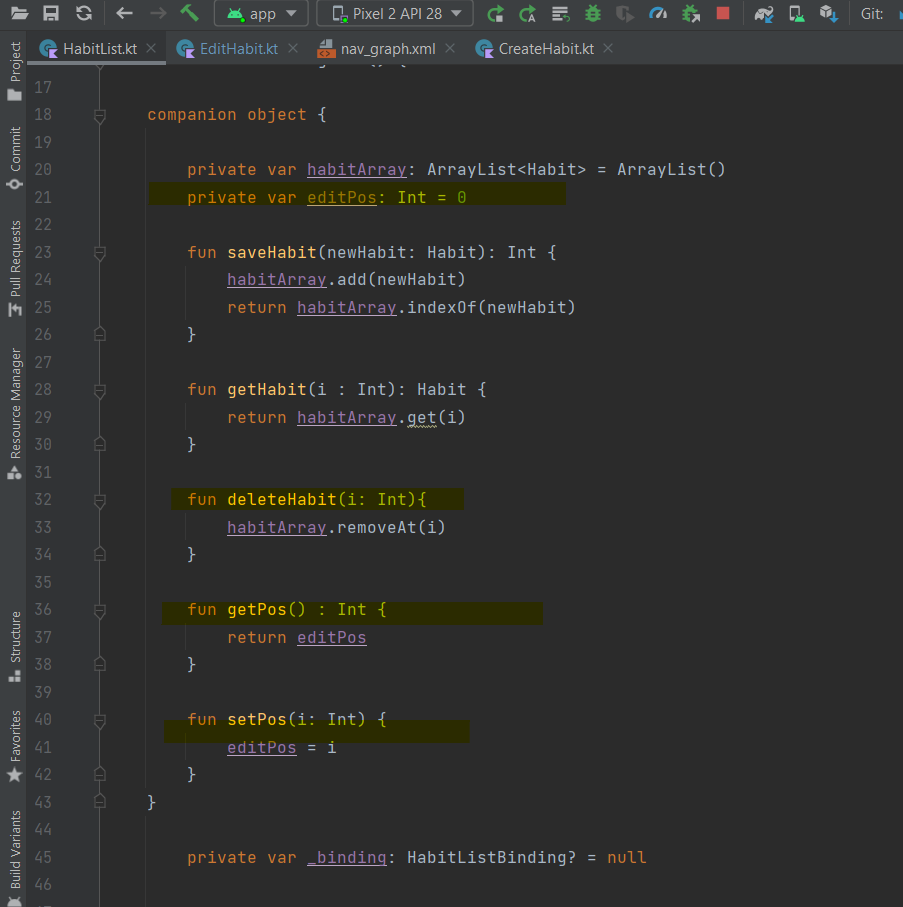

An edit button was then configured onto the habit_rows.xml so each habit in the RecyclerView would have an edit option and navigation to the edit page. The logic for this button was then implemented within the HabitListAdapter.kt file.

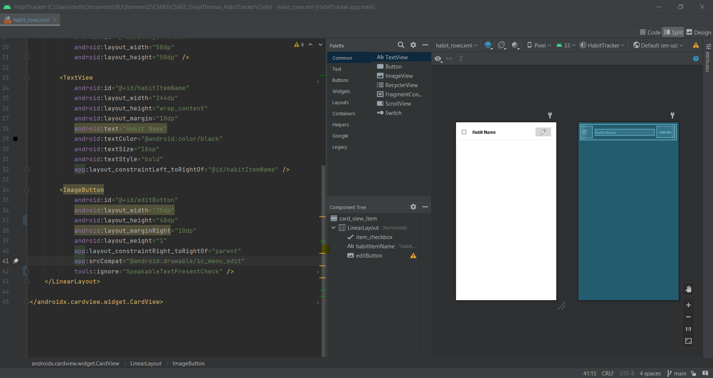

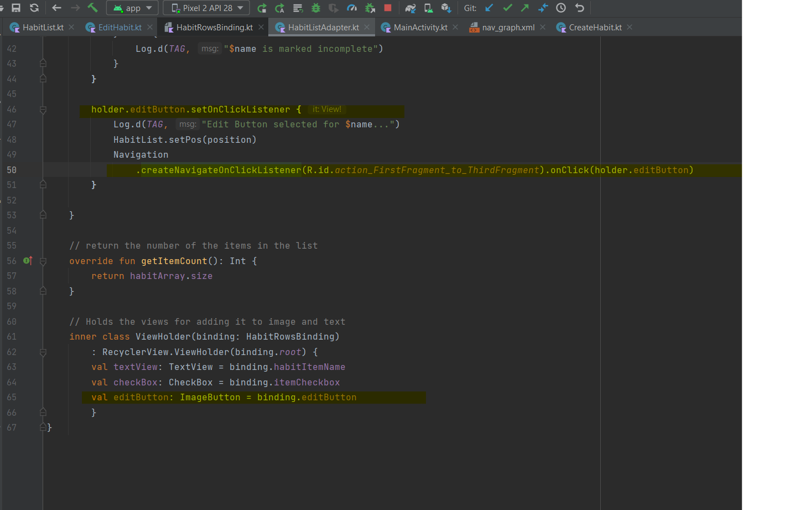

As you can see, the adapter required the binding of the edit button the viewholder as well as an onClickListener. Upon clicking the button, the corresponding habit's position is set to the editPos variable in teh companion object to be referenced, and the navigation action from nav_graph.xml to go from First Fragment to Third Fragment is called.

The edit_habit.xml file was similar to the create_habit.xml, in that it had the same editText fields, only this time with previously inserted data for the habit for the user to update. There was a similar configuration made for Lab2, so I also took notes from that assignment as well to properly configure this fragment. Please see the edit_habit.xml file below.

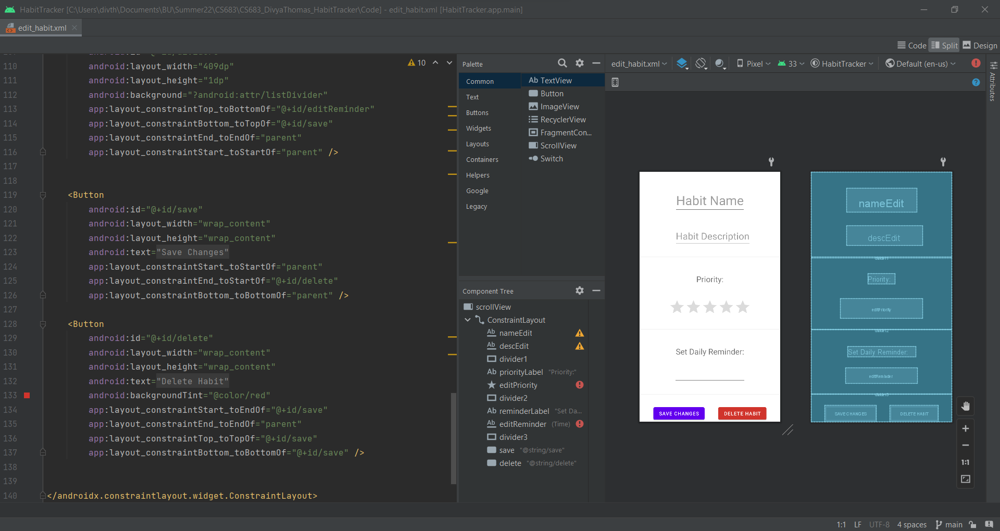

In addition to this, you can see the two new buttons at the bottom. First to save the data inputted on this page to the existing habit, and another option to delete the habit. This button will remove the habit from all data sets and the main habit list.

The majority of my work for this iteration was done on the below EditHabit.kt file, which includes the configuration of bringing the saved data for the selected habit back to the form to be updated, as well as implementing the delete functionality.

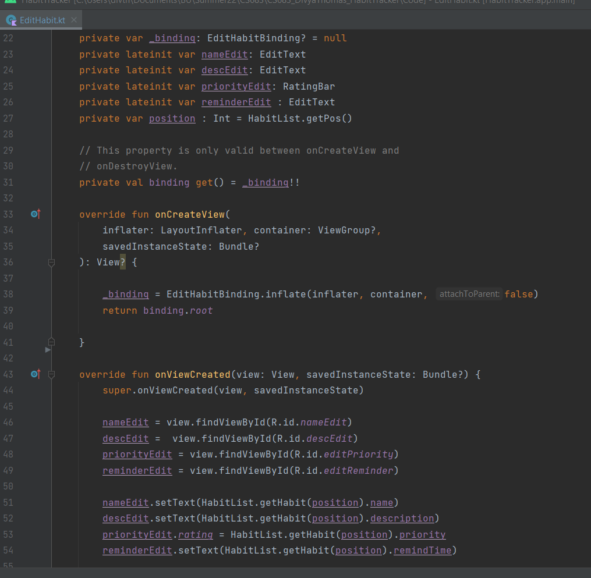

Above you can see a very similar setup to CreateHabit.kt except for the addition of setting the EditText and RatingBar values to the existing values within the habitArray (or future database).

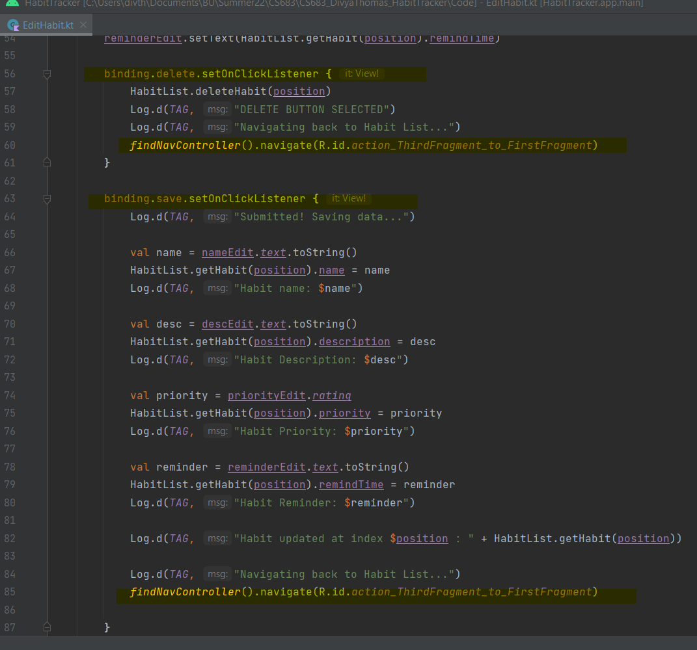

The second half of this file contains the button configurations. The delete button calls the companion object's delete method while passing in the editPos saved. The page is then navigated back to the Habit List page, now missing the deleted habit. The "Save Changes" button is also very similar to the "Submit" button's configuration from CreateHabit.kt. The difference here is that instead of creating a new Habit object to add to the habitArray, the existing habit is simply edited with the updated values in the form upon clicking the button. The user is then also navigated back to the Habit List to see the changes reflected.

### ITERATION 4:

This iteration consisted of the sole task of configuring a Room Database with the Habit Tracker application. With guidance from Module 4's notes and Lab5's solution, I was able to put together this Room database successfully. However, this task required many code additions and changes or enhancements to various current configurations. The UI and front-end functionality, on the otherhand, stayed the same as the previous iteration.

#### Adapters 

The HabitListAdapter.kt went through a few changes to remove any dependency on the previously configured habitArray companion object and replace it with a new one generated and updated by the database. The adapter also included an OnHabitClickListener to be able to set and adjust data from habit to habit.

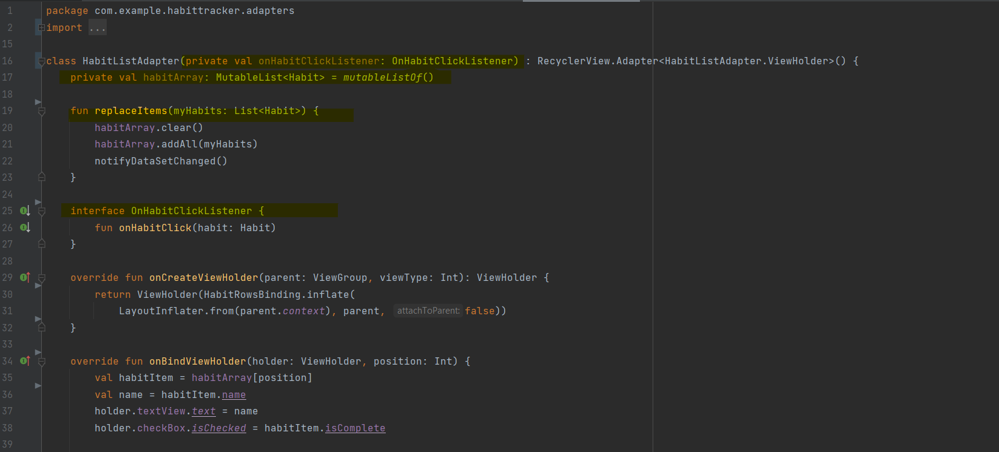
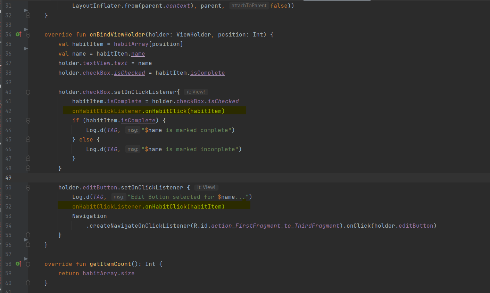
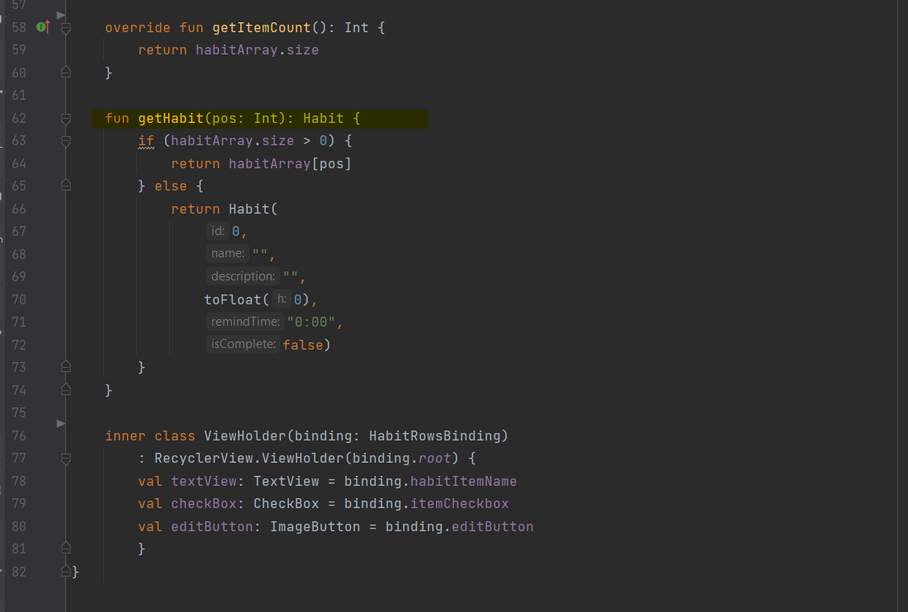

#### Data Layer 

The data layer of the project, as expected, experienced quite a few changes. The Habit.kt already existed before, but only as a data class. The additions made to this class consisted of the additions of Room database annotations to properly convert the class to a database table, with each attribute as a corresponding column in the table. I also added in a toString() function in order to help display habit data while logging. 

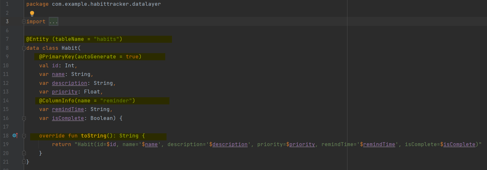

The next data layer object was the HabitDao.kt addition to the project. This is a Dao that is used to convert Kotlin code actions from the application to database queries to continuously update the local database in congruence with changes within the application.

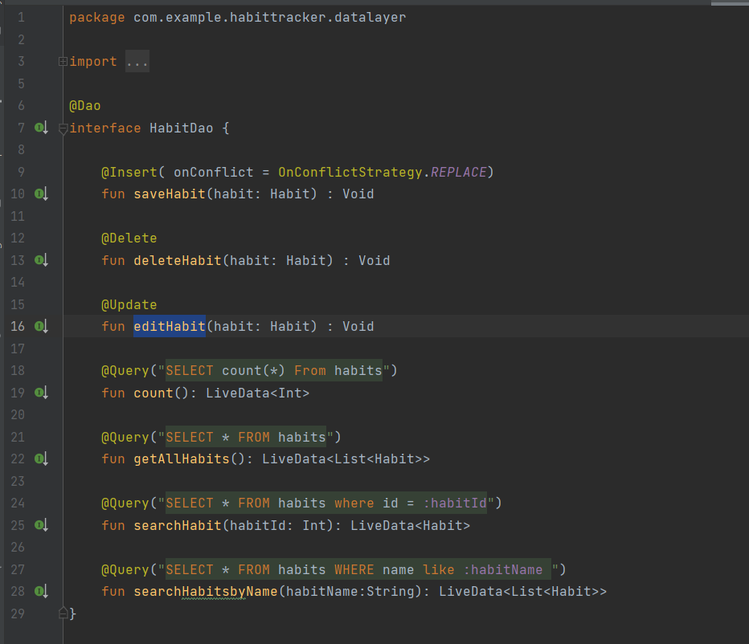

The final data layer object is the HabitsDatabase.kt that initializes the local database. This class connects the database to the Habit.kt entity, as well as the HabitDao.kt to translate between front end and back end.

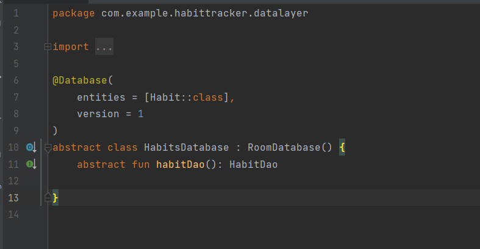

#### Fragments

While the same fragments stayed within the project, there were modifications necessary in each fragment to remove dependencies to the previous habitArray companion object that was replaced by the database and set up the OnHabitClickListener and ViewModels.

In addition to the OnHabitClickListener and ViewModels that were implemented in all fragments, the CreateHabit.kt fragment needs to incorporate creating a new Habit object and saving it in the database on the submit button click, instead of in the old habitArray. In the OnClick function for the submit button, this was implemented using the HabitListViewModel's addHabit method. 

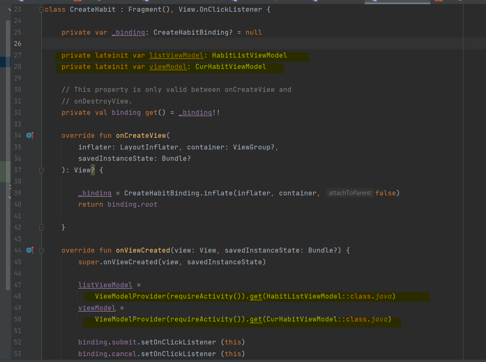
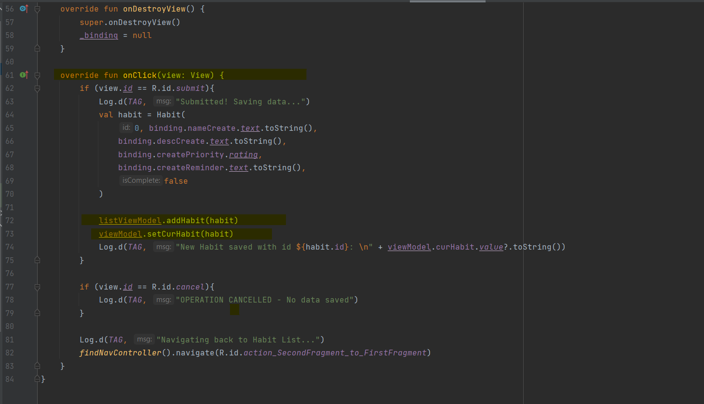

The EditHabit.kt class also had the ViewModel and Listener setups but this class needed to prefill the EditText elements with the current habit's values to be edited, instead of CreateHabit's blank form. This screen also required the save functionality (CurHabitViewModel's updateCurHabit method) and the delete functionality (CurHabitViewModel.habitTrackerRepository.deleteHabit method) to delete from the database.

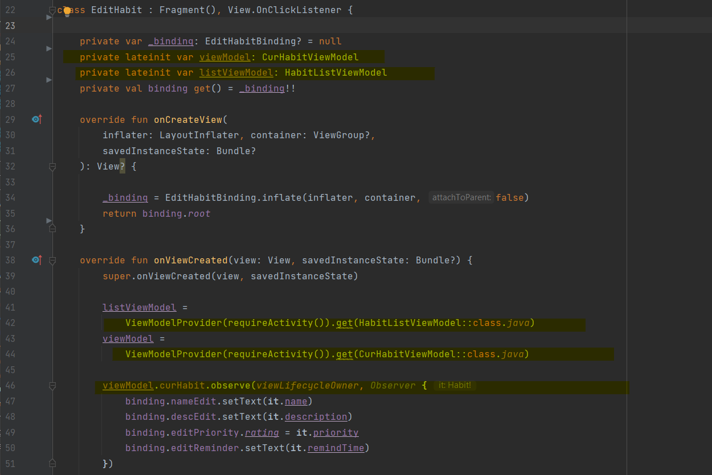
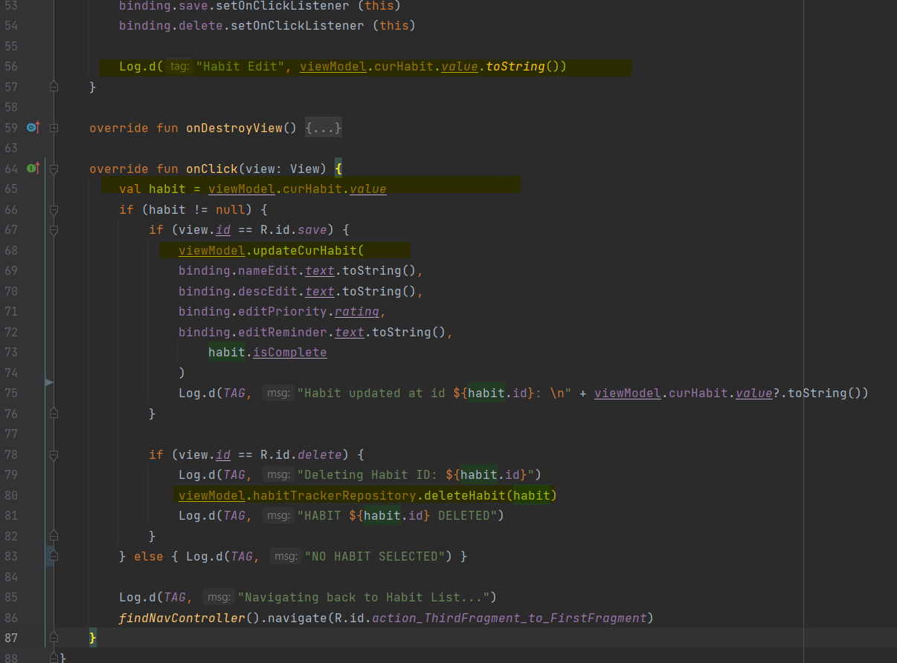

The HabitList.kt seems to have faced the most changes between the fragments. In addition to the other changes on ViewModels and Listener, this fragement was where the companion object was removed and all dependency on the previous habitArray was based here. This needed to be reconfigured to the local database instead, which was done using the ViewModels as the other fragments had as well.

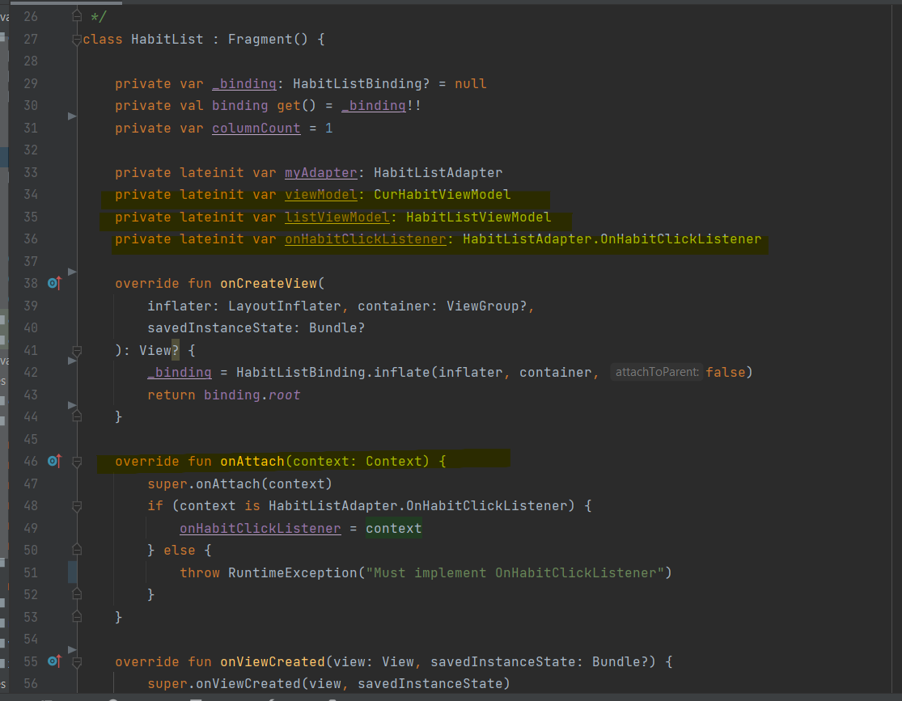
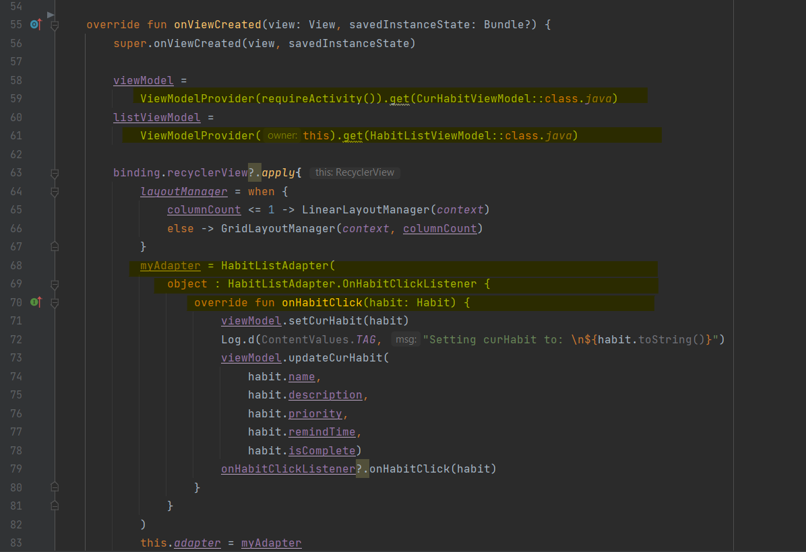
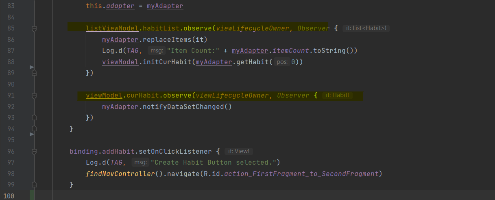

#### ViewModels

Two viewmodels were added to this application in order to provide a means for the application elements to interact with the data layer (rather than previously through the HabitList.kt companion object). The data layer, being the local database, will send and receive data from the UI components through these viewmodels. 

The HabitListViewModel.kt works with the data for all Habit objects in the database as a whole and interacts with mainly the HabitList.kt fragment. 


The CurHabitViewModel.kt does the same, but for an individual habit. Whichever habit is passed into this viewmodel as the curHabit, will be spotlighted for updating. 


#### Other Changes

A small change that was implemented was a simple OnHabitClick method definition within the MainActivity.kt class since there needed to be an implementation of the OnHabitClickListener class. No other functionality was needed for this methods, so I just used this method to log information. 


A HabitTrackerApplication.kt class was created to setup the callback to the database, the repository, and possibly set up any default initial habits for a user to start with. I don't have any initial habits set up now, as I found no need to at the moment, but this is good to have if needed in the future.


Finally, I made an addition of a HabitTrackerRepository.kt class that will encapsulate the database operations by being called by the viewmodels amd passing in the Dao as an attribute to call database methods from.


### ITERATION 5:

[TODO]

## 5. Project Structure - (recent changes highlighted)
### Iteration 1 Project Structure

### Iteration 2 Project Structure


### Iteration 3 Project Structure


### Iteration 4 Project Structure


### Iteration 5 Project Structure


## 6. Timeline - *ON TRACK*

|Iteration|Application Requirements|Android Components and Features to be used|
|---|---|---|
|1|Create/View Habit List (Essential)|Manifest File and basic UI display|
|2|Configure Habit List Display and Mark Complete Functionality (Essential)|HabitList.kt, habit_list.xml|
|3|Make existing habits deletable and editable (Essential)|HabitList.kt, possibly a new 'Edit' fragment|
|4|Save Progress and Report (Desirable)|Set up database or input file to store/reload data even upon application restart|
|5|Refresh List (Desirable) and Prioritize Habits/Filter functionality (Optional)|Each habit's individual values are edited and or used to order them on the page |

## 7. Future Work 
[TODO] - Optional

## 8. Project Demo Links

Github Link: https://github.com/CS683/metcs683projects-divthomas22

## 9. References

- Routines by Care/Of - https://apps.apple.com/us/app/routines-by-care-of/id1498695422
- Navigation for RecyclerView - https://stackoverflow.com/questions/57117726/navigation-component-in-recyclerview-adapter 
